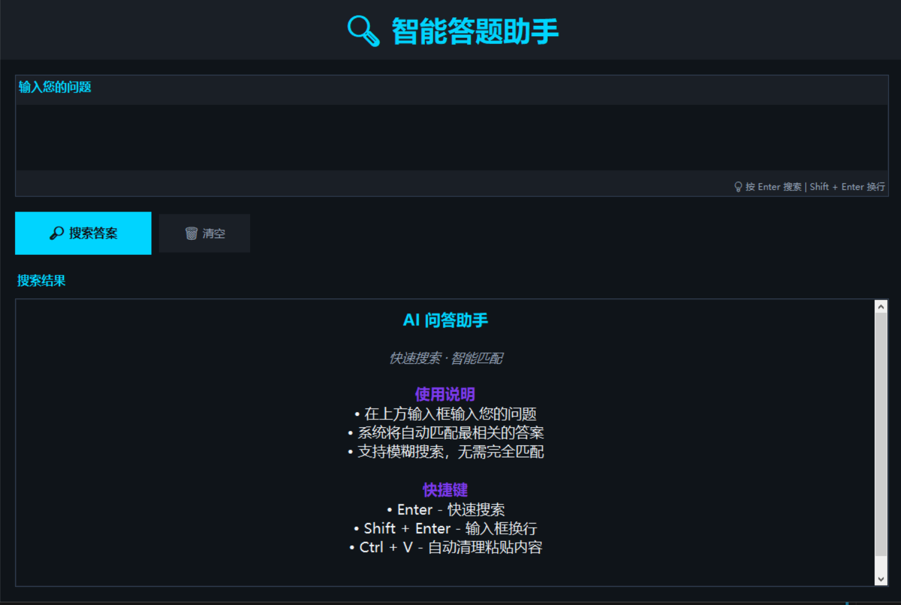
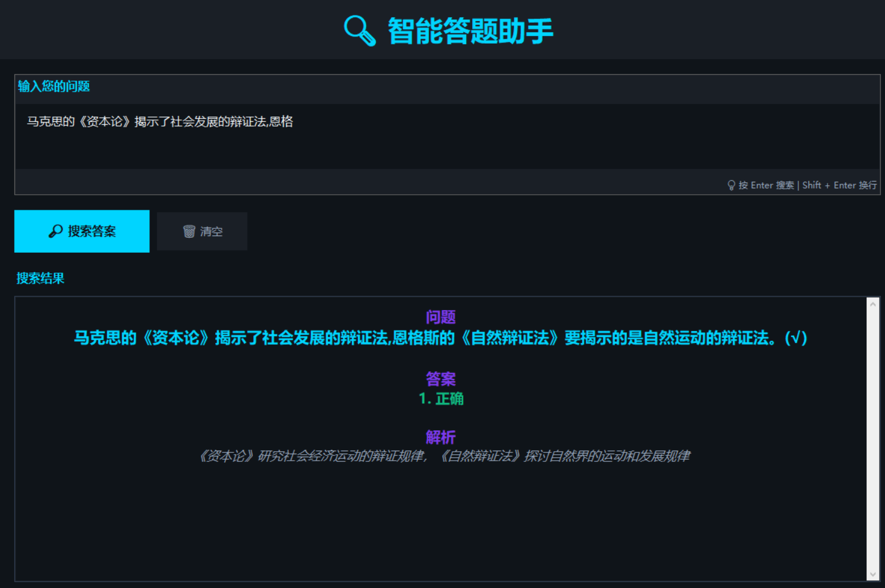

# 智能答题助手

> **秒速查题，深度解答** 🚀
> 
> 轻松建立您的私人知识库！一款功能强大的智能问答系统，支持**自定义题库**、**模糊搜索**、**多答案展示**、**详细解析**。输入关键词秒出答案，支持完全离线运行，零配置开箱即用。


## 功能特性

✨ **核心功能**
- � **秒速搜题** - 毫秒级模糊匹配，无需完全匹配题目，输入关键词立即出题
- 📚 **自由定制** - 支持 JSON 格式题库，轻松添加删除修改题目，完全掌控您的知识库
- 🎯 **完整解答** - 每道题配有问题、答案、解析，知识点讲解深入透彻
- 💻 **离线优先** - 无需网络，程序完全离线运行，数据完全私有
- 📋 **智能匹配** - 即便记不清完整题目，输入片段也能精准搜索

🎨 **视觉设计**
- 现代深色科技主题（青蓝 + 深黑），长时间使用不疲劳
- 专业的布局和排版，阅读体验舒适
- 彩色标签区分内容层级，信息清晰有力

⌨️ **快捷操作**
- `Enter` - 闪电般搜索
- `Shift + Enter` - 多行输入
- `Ctrl + V` - 一键粘贴并清理文本

## 📸 应用界面

### 主界面


### 搜索结果界面


深色科技主题，简洁美观的界面设计，提供舒适的使用体验。

## 快速开始

### 方式一：直接运行 EXE（推荐）

无需安装任何依赖，直接运行：

```bash
dist/main.exe
```

### 方式二：Python 运行

**环境要求**
- Python 3.10+
- rapidfuzz
- tkinter (Python 自带)

**安装依赖**

```bash
# 创建虚拟环境（可选）
python -m venv venv

# 激活虚拟环境
# Windows
venv\Scripts\activate
# macOS/Linux
source venv/bin/activate

# 安装依赖
pip install -r requirements.txt
```

**运行应用**

```bash
python main.py
```

## 使用说明

### 基本操作

1. **输入问题**
   - 在上方文本框输入您要搜索的题目
   - 支持关键词搜索，如"自然"、"辩证法"等

2. **搜索答案**
   - 按 `Enter` 键或点击「🔎 搜索答案」按钮
   - 系统会自动匹配最相关的题目

3. **查看结果**
   - 问题：显示匹配到的完整题目
   - 答案：以编号列表展示所有答案
   - 解析：提供专业的知识解释

4. **清空内容**
   - 点击「🗑 清空」按钮重置所有内容

### 快捷键速览

| 快捷键 | 功能 |
|--------|------|
| `Enter` | 搜索题目 |
| `Shift + Enter` | 输入框中换行 |
| `Ctrl + V` | 粘贴并自动清理 |

## 项目结构

```
zrbzf/
├── main.py                 # 主程序文件
├── main.spec              # PyInstaller 配置文件
├── questions.json         # 题库数据文件
├── requirements.txt       # Python 依赖列表
├── README.md              # 项目说明文档
├── dist/                  # 编译后的可执行文件
│   ├── main.exe          # Windows 可执行程序
│   └── questions.json    # 题库数据
├── build/                # 编译中间文件（可删除）
└── .venv/                # Python 虚拟环境（可删除）
```

## 数据格式

题库使用 JSON 格式，位于 `questions.json`

**格式示例：**

```json
[
    {
        "question": "认为自然界和人类社会是相互联系的...这种观点属于()",
        "answer": "辩证法",
        "explanation": "辩证法认为自然界和人类社会是相互联系、不断发展变化的整体"
    },
    {
        "question": "学习自然辩证法的意义在于()",
        "answer": "有助于推动生态文明建设;为科学工作者的研究活动提供理论指导;...",
        "explanation": "自然辩证法为科学研究、生态文明建设及科技战略提供理论和方法支持"
    }
]
```

**字段说明：**

| 字段 | 说明 | 是否必需 |
|------|------|--------|
| question | 题目文本 | ✅ 必需 |
| answer | 答案内容（多个用`;`分隔） | ✅ 必需 |
| explanation | 答案解析说明 | ⭕ 可选 |

## 开发指南

### 项目依赖

```txt
rapidfuzz==3.x      # 模糊匹配引擎
pyinstaller==6.x    # EXE 编译工具
```

### 编译 EXE

```bash
# 使用已有配置编译
pyinstaller main.spec --clean

# 或自定义编译参数
pyinstaller main.py --onefile --windowed --name "AI问答助手"
```

编译完成后，EXE 文件在 `dist/` 文件夹中

### 修改界面配置

在 `main.py` 中修改 `COLORS` 字典来自定义颜色主题：

```python
COLORS = {
    'bg_dark': '#0f1419',      # 深黑背景
    'bg_panel': '#1a1f26',     # 面板背景
    'primary': '#00d4ff',      # 青蓝色
    'primary_hover': '#00e8ff', # 青蓝色悬停
    'secondary': '#7c3aed',    # 紫色
    'success': '#10b981',      # 绿色
    'text_primary': '#f0f4f8',  # 主要文本
    'text_secondary': '#94a3b8', # 次要文本
    'border': '#334155'        # 边框
}
```

### 修改窗口大小

在 `QuestionAnswerGUI.__init__()` 中修改：

```python
self.root.geometry("1200x800")  # 宽度 x 高度
```

## 常见问题

### Q: 为什么搜索结果不准确？

A: 系统使用模糊匹配算法，相似度需要达到 60% 以上。建议：
- 使用题目中的关键词
- 增加输入字数提高匹配准确度
- 检查 questions.json 中是否有该题目

### Q: 如何添加更多题目？

A: 编辑 `questions.json` 文件，按照格式添加新的题目对象即可。修改后重新运行或重新编译 EXE。

### Q: EXE 文件很大，能缩小吗？

A: 可以在编译时添加参数：
```bash
pyinstaller main.py --onefile --windowed -w
```

### Q: 支持多个答案吗？

A: 支持！在 `answer` 字段中用英文分号 `;` 分隔多个答案：
```json
"answer": "答案1;答案2;答案3"
```

## 系统要求

**运行 EXE：**
- Windows 7 及以上
- 无需安装 Python

**运行源代码：**
- Python 3.10+
- Windows / macOS / Linux

## 许可证

📜 **自定义许可证** - 查看 [LICENSE](./LICENSE) 获取详细信息

### 快速说明

✅ **允许**：
- 个人学习和研究
- 非商业用途的使用和修改
- 二次开发供自己使用

❌ **需要作者同意**：
- 商业用途（盈利、销售、商业产品）
- 修改后的版本分发
- 去除原作者归属

### 📧 商业授权

如需商业授权或其他合作，请联系作者：
- GitHub: [@FeynmanNddbb](https://github.com/FeynmanNddbb)
- 邮箱: [3553303315@qq.com](mailto:3553303315@qq.com)
- 留言或 Issue 联系

作者会根据具体情况评估并决定是否授予许可。

## 更新日志

### v2.0 (2026-02-24)
- 🎨 完全重设计 UI，采用现代深色科技主题
- 📄 优化文字排版，支持居中显示
- 📏 增大字号，提升可读性
- 🔧 增强快捷键支持
- 📦 通过 PyInstaller 生成可独立运行的 EXE

### v1.1
- 初始版本功能完成

## 联系方式

如有问题或建议，欢迎反馈！如果帮助到了你麻烦给个star

---

**Made with ❤️ by Feynman**
